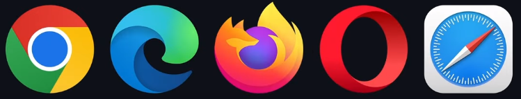

# AppleCraft

Building and Deploying an Apple Website using React,React Three Fiber, Three.js & GSAP

- I code here an iphone 15 pro clone using nothing less than GSAP and 3JS.

- And I'll not just create the clone but give the the detailed information about the tools and technologies were used in this project.

- I'll cover the core concepts of 3js and 3D development
- And this webstie has custom animations with scroll triggers, staggers timelien, a custom video slider with progress tracking, animated 3D models with diffrent configutations lights and view ports and other sections with cool animations and complete resposinveness and optimal performance.

- I'll go beyong just building and deploy it and I'm not done yet I'll also use Sentry to track its performance, like how many people visited the website and how fast it loads, what users are looking at and see if there are any issue with specific devices.

---

## GreenSock's Animation Platform(GSAP)

- GreenSock's Animation Platform often referred to as just GSAP is a high performance JavaScript animation library that allows you to effortessly animate anything JavaScript can touch. You can animate anything from UIs to SVGs to creating immersive 3D experiences from exciting scrolling animations to changes shapes of objects text effects and UI interactions. There isn't a thing you can't animate with GSAP.
- GSAP is the all-in-one solution for all of your web application animation needs. Gucci, spotify, Nike, Shopigy and even Google use GSAP.

- There's also framer motion knwon for it's gesture-based interactions and it's declarative syntax which tightly inegrates with react. For simpler animations in react it's the Top choice.

- Both the liraries have their own unique usecases but here's where GSAP takes the Throne, GSAP known for its exceptional performance even in complex animations its optimizations keep the animation smooth making it the go-to choice for applications in which performace matters.
- GSAP also offers a high leel of flexibility and control over animations allowing you to create:

  - Complex sequencews
  - Timelines
  - Effects

- GSAP is extensively testes and supported across any browsers
  

---

## 3JS

- 3js will shape the future of the web with advancements in virtual reality and wider access to more powerful device 3D development is just warming up.

- Before 3JS creating 3D graphics for the web was a complex task web developers had to rely on low-level APIs liek WEBGl or special plugin like Adobe Flash or Unity

- 3JS came in and filler this gap by abstracting away the complexities of webgl and providing a userfriendly API for building 3D scences directly in the browser using JavaScript.

### Some of the key features are:

- The abstraction fo WebGL
- It has high Cross-platform Compatibility
- It provides rich set of tools and utilities for creating immersive 3D experiences including supports for:

  - Lighting
  - Shading
  - Textures
  - Animations
  - Interaction

- It's very fast

---

Starting to learn 3js is like diving into a new and exciting world with many features and concepts.
